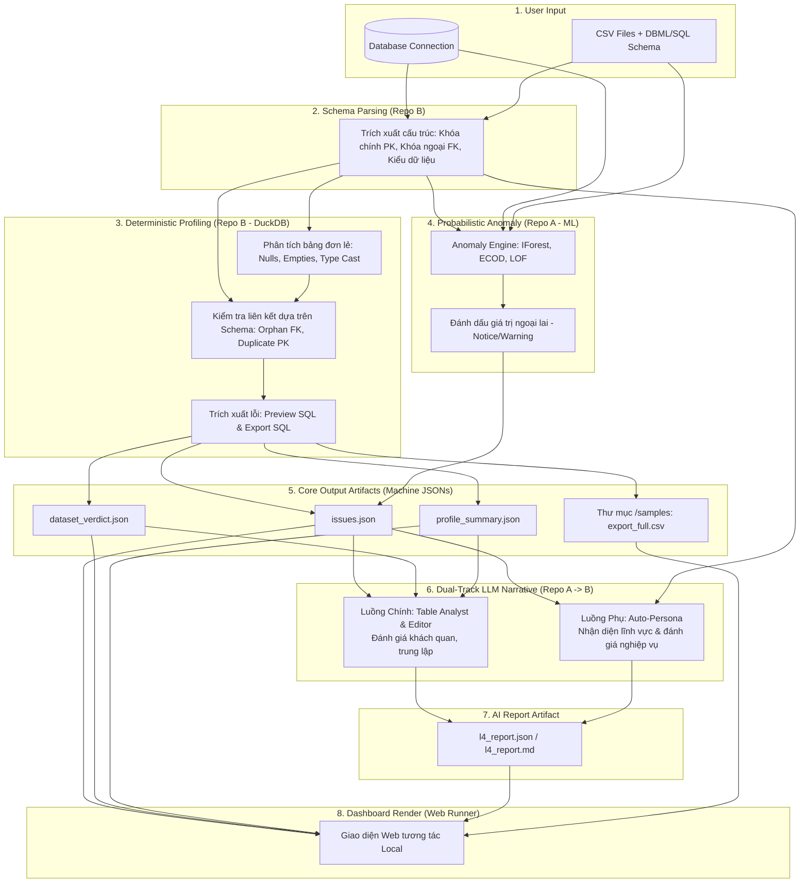
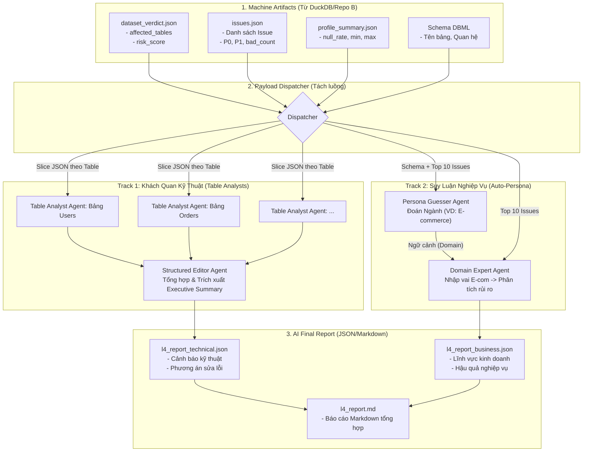

# ĐẶC TẢ KIẾN TRÚC TÍCH HỢP HỆ THỐNG SMART EDA (THE CONSTITUTION)

**Đối tượng đọc:** Đội ngũ Kỹ sư Phát triển (Backend Developers, Frontend Developers, Data Engineers)
**Mục tiêu:** Cung cấp một bản thiết kế "Hiến pháp" chi tiết, đầy đủ nhất về mặt kiến trúc, luồng dữ liệu (Data Flow) và các quyết định kỹ thuật nhằm hợp nhất sức mạnh của Repo A (Trí tuệ nhân tạo) và Repo B (Lõi xử lý SQL siêu tốc). Đảm bảo mọi Developer đều hiểu rõ chữ "Tại sao" (Why) đằng sau mỗi dòng code.

---

## 1. TỔNG QUAN KIẾN TRÚC MỚI (TARGET ARCHITECTURE)

Hệ thống sau khi hợp nhất sẽ hoạt động theo mô hình **Zero-Config Business Rules**. Người dùng cung cấp Dữ liệu thô và Lược đồ cấu trúc (Schema) có sẵn, hệ thống sẽ tự động quét toàn bộ mọi thứ.

---

## 2. LUỒNG DỮ LIỆU CHI TIẾT (END-TO-END WORKFLOW)

Để đảm bảo Developer hình dung chính xác hệ thống vận hành thế nào trong thực tế, dưới đây là luồng xử lý chi tiết từ đầu đến cuối:

### Bước 1: Khởi tạo (Ingestion) & Schema Parsing
- **Hành động:** Người dùng cung cấp kết nối thẳng vào Database, HOẶC upload các file CSV kèm theo file mô tả cấu trúc `schema.dbml` / `schema.sql`.
- **Xử lý:** Module Schema Parser của Repo B đọc DBML/SQL để nạp danh sách các Bảng, Cột, Kiểu dữ liệu, Khóa chính (PK), Khóa ngoại (FK) vào bộ nhớ.

### Bước 2: Truy quét lỗi cấu trúc (Deterministic Profiling bằng DuckDB)
- **Hành động:** DuckDB (Repo B) chạy các câu lệnh SQL siêu tốc để tìm ra các lỗi hiển nhiên sai **dựa trên Schema gốc đã parse ở Bước 1**.
- **Phân loại lỗi:**
  - *Mức P0 (Critical):* Rỗng Khóa Chính (PK Null), Trùng Khóa Chính.
  - *Mức P1 (High):* Khóa ngoại mồ côi (Orphan FK - VD: ID đơn hàng không tồn tại ở bảng User), Rỗng trường NOT NULL.
  - *Mức P3 (Warn):* Dữ liệu chứa ký tự rác (N/A, Unknown).

### Bước 3: Truy quét giá trị ngoại lai (Anomaly Engine)
- **Hành động:** Chạy `anomaly_engine.py` (bưng từ Repo A sang) sử dụng thuật toán IForest/ECOD.
- **Kết quả:** Tìm ra các con số "đột biến" (Outliers).
- **Rationale:** DuckDB chỉ tìm được lỗi cấu trúc, không hiểu được sự vô lý về mặt toán học (VD: Lương 10 tỷ). Chạy thêm bước này để lấp đầy lỗ hổng kiểm soát chất lượng. Lỗi này chỉ được gán nhãn `NOTICE/WARNING`.

### Bước 4: Xuất Core Artifacts (Machine JSONs)
- **Hành động:** Hệ thống tổng hợp các kết quả lỗi từ Bước 2 và Bước 3 để ghi ra các file JSON gốc (Machine-readable) bao gồm: `issues.json`, `profile_summary.json`, `dataset_verdict.json`.
- **Đồng thời:** Các câu lệnh `export_sql` sinh ra ở Bước 2 sẽ trút toàn bộ dữ liệu lỗi ra các file vật lý `issue_xyz_full.csv` nằm trong thư mục `/samples`.
- **Rationale:** Đây là dữ liệu gốc thô rập. AI bắt buộc phải đọc từ các file này mới có thể biết được quy mô lỗi để đánh giá.

### Bước 5: Diễn giải bằng AI (Dual-Track LLM)
Khối dữ liệu JSON thô sinh ra ở Bước 4 sẽ được nạp vào AI (chạy sau cùng). Quá trình này chia làm 2 luồng độc lập:
- **Luồng Chính (Khách quan):** Multi-Agent (Analyst & Editor) đọc `issues.json` và `dataset_verdict.json`, giải thích hệ quả mặt kỹ thuật (VD: "5% thiếu ID sẽ làm sai lệch khi JOIN"). TUYỆT ĐỐI KHÔNG NHẬP VAI.
- **Luồng Phụ (Auto-Persona):** AI đọc file DBML/SQL ở Bước 1 để đoán lĩnh vực (VD: E-commerce), sau đó đọc `issues.json` -> Nhập vai chuyên gia E-commerce -> Phán quyết rủi ro nghiệp vụ.
- **Kết quả:** Tổng hợp thành file `l4_report.json` và `l4_report.md`.

### Bước 6: Render Dashboard
- Web UI (Frontend) đọc các file: `issues.json`, `dataset_verdict.json` và `l4_report.json` để vẽ lên Dashboard.
- Cung cấp nút bấm khổng lồ: **"Tải về toàn bộ CSV dòng lỗi"** (trỏ tới file CSV ở Bước 4).

---

## 3. CÁC "VẾT XE ĐỔ" CẦN TRÁNH (ANTI-PATTERNS & REJECTED IDEAS)

Phần này là bắt buộc để các thế hệ Developer sau không đi lại vào vết xe đổ mà team Kiến trúc sư đã mất nhiều ngày để loại bỏ. **TUYỆT ĐỐI KHÔNG IMPLEMENT CÁC TÍNH NĂNG SAU:**

### ❌ Anti-pattern 1: Yêu cầu người dùng viết YAML Business Rules
- **Ý tưởng ban đầu:** Bắt người dùng định nghĩa file `rules.yaml` để kiểm tra logic phức tạp (VD: `ngày_giao > ngày_đặt`, `trạng_thái in [A,B,C]`).
- **Tại sao bị loại bỏ?** *"Garbage in, garbage out"*. Việc yêu cầu người dùng viết YAML là quá phức tạp. Việc kiểm tra cấu trúc cơ bản (PK, FK) đã được DuckDB đảm nhiệm dựa trên Schema (DBML/SQL) đầu vào. Hệ thống chỉ tập trung vào lỗi cấu trúc và ngoại lai thuần túy, không ôm đồm các luật kinh doanh (Business Logic) rườm rà.
- **Quy tắc cho Dev:** Gọt bỏ hoàn toàn cờ `--rules` trong `cli.py` và xóa module `quality_rules.py` xử lý YAML.

### ❌ Anti-pattern 2: Gán Role/Lĩnh vực cho LLM ngay từ đầu
- **Ý tưởng ban đầu:** Viết thẳng vào Prompt chính: *"Bạn là chuyên gia kinh doanh, hãy phân tích..."*.
- **Tại sao bị loại bỏ?** Gây ra "Thiên kiến nhận thức" (Cognitive Bias) cho AI. Nếu bộ dữ liệu là của Ngành Y Tế, AI đóng vai Kinh doanh sẽ làm lơ các yếu tố quan trọng về Bệnh lý để đi tìm Lợi nhuận. 
- **Quy tắc cho Dev:** Bắt buộc tuân thủ "Luồng LLM Kép" (Dual-Track). Đánh giá lỗi kỹ thuật phải hoàn toàn trung lập. Việc nhập vai (Auto-Persona) chỉ được chạy ở một luồng Call phụ cách ly hoàn toàn.

### ❌ Anti-pattern 3: Sử dụng Compound Severity của Repo A
- **Ý tưởng ban đầu:** Dùng module `calibrator.py` của Repo A để đoán xem một lỗi rỗng có nguy hiểm không.
- **Tại sao bị loại bỏ?** Dư thừa và kém chính xác. Cỗ máy DuckDB của Repo B nhờ có DBML đầu vào đã biết đích xác cột nào là Khóa chính (PK), Khóa ngoại (FK). Nó gán thẳng P0, P1 một cách tuyệt đối chính xác (Deterministic) bằng mã SQL. Việc dùng logic đoán (Probabilistic) của Repo A đắp lên sẽ làm hỏng hệ thống chuẩn của Repo B.

### ❌ Anti-pattern 4: Bê nguyên xi code HTML Render của Repo A
- **Ý tưởng ban đầu:** Dùng `html_merger.py` của Repo A.
- **Tại sao bị loại bỏ?** Repo B đã có kiến trúc rành mạch: Backend sinh JSON, Frontend Web App vẽ UI. Việc nhét code Python sinh HTML thô thiển vào sẽ phá vỡ kiến trúc Frontend độc lập.

---

## 4. CHI TIẾT TÍCH HỢP & GIAO VIỆC (IMPLEMENTATION BLUEPRINT)

Developer thực thi các module sau theo đúng chỉ định với codebase gốc của **Repo B**:

### Module 1: Anomaly Engine (Cấy ghép)
- Lấy file `src/engines/anomaly_engine.py` (từ Repo A) bỏ vào thư mục `src/vsf_profiler/` của Repo B.
- Mở `src/vsf_profiler/cli.py`, gọi hàm `run_anomaly_detection(df)` vào ngay sau bước chạy kiểm tra liên kết (`run_relationship_checks`).
- Ghi nhận lỗi bằng hàm `issue_catalog.add_issue(issue_type="OUTLIER", severity="NOTICE"...)`.

### Module 2: Sửa giới hạn CSV 50 dòng (Nâng cấp)
Trong Repo B, giới hạn `LIMIT 50` nằm rải rác trong câu truy vấn truyền vào `add_issue`.
- Mở file `src/vsf_profiler/relationship_checker.py` và `src/vsf_profiler/table_assessments.py`.
- Tìm các dòng code sinh biến chứa chuỗi `LIMIT 50`.
- Sửa đổi hàm `IssueCatalog.add_issue()` (nằm trong `issue_catalog.py`) để nhận thêm tham số `export_sql` (câu lệnh SQL loại bỏ LIMIT).
- Ghi file JSON cho bảng Preview dùng SQL cũ, nhưng khi lưu file `issue_xyz.csv` vật lý vào thư mục `/samples` phải dùng `export_sql` (dữ liệu đầy đủ).

### Module 3: Dual-Track LLM Narrative (Refactor lõi)
- Bóc tách `l4_report.py` của Repo A. Di dời các Pydantic Models và khối gọi API sang `src/vsf_profiler/llm_narrative.py` của Repo B.
- Cập nhật Prompt cho `Structured Editor` (Luồng chính): Chấm dứt dùng các từ khóa như "Machine Learning", "Linear Regression". Yêu cầu đánh giá khách quan về chất lượng cấu trúc dữ liệu. Kết quả ghi vào `l4_report.json`.
- Xây dựng thêm hàm: `_run_domain_insight_agent()`. Input là Schema (DBML/SQL) và top lỗi. Output là chuỗi String 3-4 câu giải thích hệ quả rủi ro theo góc nhìn chuyên gia lĩnh vực tương ứng. Ghi đè biến này vào file JSON đầu ra.

### Module 4: Điều chỉnh Frontend Web App
- Mở thư mục `web/` của Repo B. Xóa nút Upload YAML Rules trên màn hình nạp dữ liệu.
- Sửa giao diện Dashboard để hiển thị `domain_insight` vào một box có background khác màu.
- BẮT BUỘC hiển thị dòng chú thích: *"Lưu ý: Đây là nhận định nghiệp vụ do AI tự động nhập vai dựa trên cấu trúc dữ liệu. Bạn chỉ nên dùng làm tài liệu tham khảo."*
- Xây nút **"Download Full Error CSV"** gọi tới file CSV sinh ra từ `export_sql`. Mọi lỗi dù là Null hay Outlier đều phải trỏ được về đúng ID gốc để người dùng mang đi sửa chữa.

---

## 5. ĐẶC TẢ KIẾN TRÚC LAYER LLM (DUAL-TRACK WORKFLOW)

Dựa trên nguyên tắc ưu tiên **sự rành mạch của kiến trúc** thay vì cố gắng bảo tồn các Prompts cũ, luồng dữ liệu bơm vào LLM sẽ được thiết kế lại hoàn toàn. Cấu trúc mới sẽ nạp trực tiếp các file JSON gốc của Repo B (DuckDB) vào hệ thống Multi-Agent và tái cấu trúc (rewrite) toàn bộ Prompts để các Agents tự hiểu danh pháp mới (như `P0`, `P1`, `bad_count`).

### 5.1. Sơ đồ Luồng Hoạt Động Của Layer LLM

Sơ đồ dưới đây mô tả chính xác đường đi của dữ liệu (Data Flow) kể từ khi các file JSON thô được sinh ra cho tới khi xuất bản báo cáo cuối cùng.

### 5.2. Giải Thích Kỹ Thuật Chi Tiết Từng Giai Đoạn

#### Giai đoạn 1: Machine Artifacts (Nguồn Dữ Liệu)
Layer LLM hoàn toàn mù tịt về Database hay CSV. Nó chỉ giao tiếp thông qua 4 đầu vào JSON/DBML:
- **`dataset_verdict.json`**: Lấy danh sách các bảng bị lỗi (trường `affected_tables`) làm gốc để chia việc.
- **`issues.json`**: Cung cấp chi tiết ngọn ngành các lỗi (thiếu khóa, rỗng, outlier) cùng mức độ nghiêm trọng `P0`, `P1`, `P2`, `P3`.
- **`profile_summary.json`**: Bơm thêm số liệu tỷ lệ rỗng (`null_rate`), min, max để AI có thêm số liệu phán đoán độ bất thường.
- **`Schema DBML`**: Cung cấp bức tranh toàn cảnh về cách các bảng liên kết với nhau.

#### Giai đoạn 2: Payload Dispatcher (Người Điều Phối)
Thay vì gửi nguyên 1 cục JSON khổng lồ khiến LLM bị tràn context (Token Limit) và "ảo giác" (Hallucination), Dispatcher là một hàm Python đơn giản làm nhiệm vụ:
- Cắt nhỏ (slice) `issues.json` ra thành từng khối tương ứng với từng Bảng (Table).
- Bơm khối JSON của Bảng A cho Track 1.
- Gom lấy Top 10 lỗi nặng nhất toàn hệ thống (Dựa vào P0, P1) bơm sang Track 2.

#### Giai đoạn 3: Track 1 - Objective Technical Review (Khách quan, Không suy diễn)
Đây là cốt lõi của công việc làm sạch dữ liệu. Mục tiêu là phục vụ Data Engineer/Data Scientist.
- **Input:** Khối JSON của một Bảng cụ thể.
- **Table Analyst Agent (Phân tích viên):** Chạy song song nhiều Agent (Fan-out) để tiết kiệm thời gian. Agent đọc P0, P1, P2 để đưa ra nhận xét kỹ thuật thuần túy. 
  - *Ví dụ output:* "Bảng `orders` có 5% `customer_id` bị Null (P0). Hậu quả: Mất dữ liệu khi JOIN với bảng `users`."
- **Structured Editor Agent (Tổng biên tập):** Gom kết quả của tất cả Table Analysts lại. Viết một đoạn tóm tắt `Executive Summary`.
- **Luật Prompt nghiêm ngặt:** Bắt buộc AI xưng hô trung lập. Nghiêm cấm mọi suy diễn về tiền bạc, doanh thu, hay cảm xúc.

#### Giai đoạn 4: Track 2 - Auto-Persona Business Insight (Đánh giá Nghiệp vụ)
Khác biệt hoàn toàn với Track 1, Track này được nới lỏng để phục vụ Product Manager/Business Users.
- **Input:** Cấu trúc Schema (tên bảng/cột) và Top 10 lỗi nặng nhất của toàn bộ hệ thống.
- **Persona Guesser Agent:** Nhiệm vụ duy nhất là đọc cấu trúc Schema để đoán: "Dữ liệu này thuộc ngành nào?". 
  - *Ví dụ:* Có bảng `Patients`, `Doctors`, `Treatments` -> Ngành Y Tế.
- **Domain Expert Agent:** Lấy kết quả "Ngành Y Tế" làm kim chỉ nam. Nhập vai thành Chuyên gia Y Tế. Đọc Top lỗi và chém gió về rủi ro.
  - *Ví dụ output:* "Vì 10% hồ sơ bệnh án thiếu ID bệnh nhân (P0), bệnh viện sẽ gặp rủi ro pháp lý lớn khi đối soát bảo hiểm, hoặc có thể kê sai thuốc cho bệnh nhân."

#### Giai đoạn 5: AI Final Report
- **Output Kỹ thuật (`OUT_T`)**: Render thành bảng biểu, chỉ ra chính xác cột nào, dòng nào bị lỗi, cách fix code ra sao.
- **Output Nghiệp vụ (`OUT_B`)**: Nằm gọn trong một Box nổi bật riêng trên Dashboard (có cảnh báo: "Đây là nhận định AI, chỉ mang tính tham khảo").
- Hai output này kết hợp sinh ra một file Markdown hoàn chỉnh `l4_report.md` và các khối JSON để Web App có thể vẽ giao diện trực quan.

> [!IMPORTANT]
> **Điểm Nhấn Kiến Trúc:** Bằng cách cô lập Track 1 và Track 2, chúng ta giải quyết được mâu thuẫn lớn nhất của các công cụ EDA: Nếu quá khô khan thì người làm Business không hiểu, mà nếu quá "chém gió" thì Data Engineer lại không tin tưởng. Kiến trúc này đáp ứng hoàn hảo cả hai tập người dùng.
